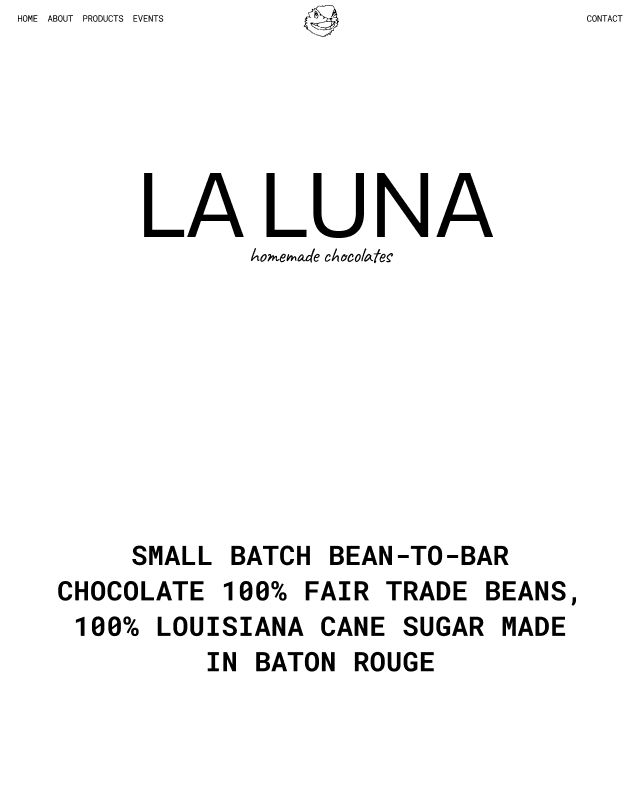

# La Luna Chocolates

A custom Next.js website for La Luna Chocolates, designed to provide a smooth, engaging user experience. Features include a responsive layout, interactive UI with smooth transitions, and fast loading optimized through Vercel. The site also includes an email form for collecting user information, integrated with SMTP for direct communication. Developed using Next.js, React, and Figma, and automatically deployed with Vercel for seamless updates.

- [Mockup]()
- [Prototype]()

## Image

## Features

- **Responsive Design**: Ensure a seamless experience across devices.
- **Interactive UI**: Engage users with smooth transitions and interactive elements.
- **Fast Loading**: Optimized for performance with Next.js and Vercel.
- **Form Requests**: Gathering users data and email to users SMTP Email.

## Technologies Used

- [Next.js](https://next.js.org/)
- [React](https://reactjs.org/)
- [Figma](https://www.figma.com/)
- [Vercel](https://vercel.com/)

## Deployment

This project is automatically deployed on Vercel. Any changes pushed to the main branch will trigger a new deployment.
